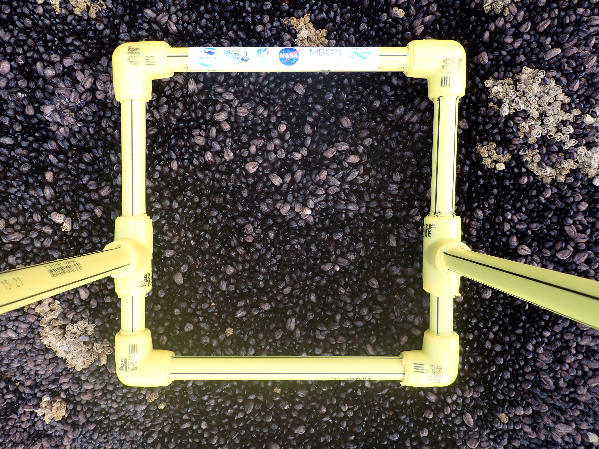

```{r setup, include=FALSE}
library(flexdashboard)
library(leaflet)
library(ggplot2)
library(plotly)
library(spocc)
library(readr)
library(reshape2)
library(xts)
library(dygraphs)
library(plotly)
library(lubridate)
library(dplyr)


library(RColorBrewer)
palette(brewer.pal(8, "Set2"))


```

```{r dataread, message=FALSE, warning=FALSE, include=FALSE}
#READ both files metadata and percent covers 
setwd(paste0(getwd(),"/DATA"))#set new WD to folder DATA
# AMP.cover <- read.csv("percent_covers.csv")
AMP.cover <- read.csv("PtaBSAS_percent_covers.csv")
# AMP.metadata <- read.csv("metadata.csv")
AMP.metadata <- read.csv("PtaBSAS_metadata.csv")
setwd("..")# original WD

colnames(AMP.cover)[2] <-"Name" 
#Merge AMP.metadata and AMP.cover
AMP<- merge(AMP.metadata,AMP.cover, by = "Name", all.x = TRUE) 

#Create long type dataframe 
library(reshape)
AMP_long = melt(AMP, id.vars = 1:21, measure.vars = 22:ncol(AMP), variable_name = "CATAMI", value_name ="cover", na.rm = T)
#rename columns because the ontop command is not working 
colnames(AMP_long)[23] <- "cover"

#Calculate mean, SD, SE for cover data by factors 
library(doBy)
Coverdata <- summaryBy(cover ~ CATAMI + strata,data=AMP_long, FUN = function(x) { c(mean = mean(x),SD=sd(x),SE = sqrt(var(x)/length(x)))})

#add year from date info
AMP$year <- lubridate::year(AMP$Date)
photo_bydate = as.data.frame(table(AMP$year,AMP$site,AMP$strata))
colnames(photo_bydate)=c("Fecha","Sitio","Estrato","n fotocuadrantes")  

#SST
#getSST.r was used to get data 
## get sampling event dates
samplingDates = unique(AMP$Date)

## read SST values
library(readr)
setwd(paste0(getwd(),"/DATA"))#set new WD to folder DATA
SST = read_csv("PtaBSAS_SST.csv")
SST.clim = read_csv("PtaBSAS_Climatology.csv")
setwd("..")# original WD
```


Column1 {.tabset .tabset-fade}
-------

### Mapa Fotoquadrantes
```{r map, message=FALSE, warning=FALSE}
library(leaflet)
leaflet() %>% 
addMiniMap(toggleDisplay = T) %>% 
addProviderTiles(providers$Esri.WorldImagery) %>%
addCircleMarkers(data = AMP, ~Longitude, ~Latitude,weight = 0.5,col = 'green', fillColor = 'green',radius = 4, fillOpacity = 0.5, stroke = T, label =AMP$Name,group ='Fotocuadrantes')%>%
addLayersControl(overlayGroups = c("Fotocuadrantes"),options = layersControlOptions(collapsed = FALSE),position = 'topright')
```


### Temperatura superficial del mar (°C) 
```{r SST}
## plot SST from stored values
# [Datos extraidos de ERDDAP](https://coastwatch.pfeg.noaa.gov/erddap/info/jplMURSST41/index.html)

SST.xts = as.xts(SST$SST, SST$time)
dygraph(SST.xts, 
        ylab = "Temperatura del mar superficial °C") %>% 
  dySeries("V1", label ="SST °C", color = "steelblue") %>%
  dyHighlight(highlightCircleSize = 5, 
              highlightSeriesBackgroundAlpha = 0.2,
              hideOnMouseOut = FALSE) %>% 
  dyOptions(fillGraph = FALSE, fillAlpha = 0.4) %>% 
  dyEvent(samplingDates,  color="red") %>% 
  dyRangeSelector(dateWindow = c(max(SST$time) - years(5), max(SST$time)))

```

### Climatología
```{r}
## subset SST for last year
SST.lastyear = SST %>% filter(year(time)==max(year(time)))

## make the plot
pp = ggplot(SST.clim, aes(yDay, SST.mean))
pp = pp + geom_line() + geom_smooth(span=0.25, se=FALSE, colour="steelblue") +  
  geom_ribbon(aes(ymin=SST.q25, ymax=SST.q75), fill="steelblue", alpha=0.5) +
  geom_line(data=SST.lastyear, aes(yday(time), SST), colour="red") + 
  ylab("Temperatura del mar superficial °C") + xlab("Día del año") + 
  theme_bw(base_size = 9) 
ggplotly(pp) %>% plotly::config(displayModeBar = F) 

```


### Cobertura de organismos vivos por estrato
```{r taxacover}
# Use this when using percent_covers.csv and full names from CoralNet
# taxacover = AMP_long %>% filter(CATAMI != "Substrate..Consolidated..hard.") %>% 
#   group_by(site, strata, Image.ID) %>% 
#   summarise(sumcover = sum(cover, na.rm=T))

# Use this when using percent_covers_AMP2023.cvs and short names from CoralNet
taxacover = AMP_long %>% filter(CATAMI != "SC") %>% 
  group_by(site, strata, Image.ID) %>% 
  summarise(sumcover = sum(cover, na.rm=T))

pp = ggplot(taxacover, aes(x=factor(strata,level=c('LOWTIDE', 'MIDTIDE', 'HIGHTIDE')), sumcover, fill=strata))
pp = pp + geom_boxplot() + ylab("% Cobertura de todas las especies por cuadrante") + xlab("")+
  facet_grid(~site) + 
  theme_bw(base_size = 10) + theme(legend.position = "none")
ggplotly(pp)
```

### Coberturas de Molluscos

<!--  -->
```{r}
# this creates a gauge with % cover values color coded by threshold levels
library(echarts4r)

# Use this when using percent_covers.csv and full names from CoralNet
# value <- Coverdata[Coverdata$CATAMI == "Molluscs..Bivalves", ]

# Use this when using percent_covers_AMP2023.cvs and short names from CoralNet
value <- Coverdata[Coverdata$CATAMI == "MOB", ]

Molluscs <- e_charts() %>% 
  e_gauge(round(value$cover.mean[1], 0), 
          "ALTO", 
          center = c("20%", "20%"), 
          radius = "30%",
          color = "black",
          min=0, 
          max=100,
          splitNumber = 10,
          axisLine = list(
            lineStyle = list(
              color=list(
                c(0.20, "red"),
                c(.50, "yellow"),
                c(1, "green")
              )
            ))) %>% 
    e_gauge(round(value$cover.mean[3], 0), 
          "MEDIO", 
          center = c("50%", "20%"), 
          radius = "30%",
          color = "black",
          min=0, 
          max=100,
          splitNumber = 10,
          axisLine = list(
            lineStyle = list(
              color=list(
                c(0.20, "red"),
                c(.50, "yellow"),
                c(1, "green")
              )
            ))) %>% 
      e_gauge(round(value$cover.mean[2], 0), 
          "BAJO", 
          center = c("80%", "20%"), 
          radius = "30%",
          color = "black",
          min=0, 
          max=100,
          splitNumber = 10,
          axisLine = list(
            lineStyle = list(
              color=list(
                c(0.20, "red"),
                c(.50, "yellow"),
                c(1, "green")
              )
            ))) %>% 
  e_title("Moluscos (%)")

Molluscs

# # High tide
# gauge(value$cover.mean[1], min = 0, max = 100, symbol = '%', 
#       gaugeSectors(success = c(60, 100), warning = c(40, 59), danger = c(0, 39)),
#       label = "Estrato alto"
#       )
# 
# # Mid tide
# gauge(value$cover.mean[3], min = 0, max = 100, symbol = '%', 
#       gaugeSectors(success = c(60, 100), warning = c(40, 59), danger = c(0, 39)),
#       label = "Estrato medio"
#       )
# 
# # Low tide
# gauge(value$cover.mean[2], min = 0, max = 100, symbol = '%', 
#       gaugeSectors(success = c(60, 100), warning = c(40, 59), danger = c(0, 39)),
#       label = "Estrato bajo"
#       )
```

### Coberturas de Macro-Algas

<!--  -->
```{r}
# this creates a gauge with % cover values color coded by threshold levels
library(echarts4r)

# Use this when using percent_covers.csv and full names from CoralNet
value <- Coverdata[Coverdata$CATAMI == "Crustacea..Barnacles", ]

# Use this when using percent_covers_AMP2023.cvs and short names from CoralNet
value <- Coverdata[Coverdata$CATAMI == "MAS", ]

MAS <- e_charts() %>% 
  e_gauge(round(value$cover.mean[1], 0), 
          "ALTO", 
          center = c("20%", "20%"), 
          radius = "30%",
          color = "black",
          min=0, 
          max=100,
          splitNumber = 10,
          axisLine = list(
            lineStyle = list(
              color=list(
                c(0.10, "red"),
                c(.30, "yellow"),
                c(1, "green")
              )
            ))) %>% 
    e_gauge(round(value$cover.mean[3], 0), 
          "MEDIO", 
          center = c("50%", "20%"), 
          radius = "30%",
          color = "black",
          min=0, 
          max=100,
          splitNumber = 10,
          axisLine = list(
            lineStyle = list(
              color=list(
                c(0.10, "red"),
                c(.30, "yellow"),
                c(1, "green")
              )
            ))) %>% 
      e_gauge(round(value$cover.mean[2], 0), 
          "BAJO", 
          center = c("80%", "20%"), 
          radius = "30%",
          color = "black",
          min=0, 
          max=100,
          splitNumber = 10,
          axisLine = list(
            lineStyle = list(
              color=list(
                c(0.10, "red"),
                c(.30, "yellow"),
                c(1, "green")
              )
            ))) %>% 
  e_title("Macro-algas (%)")

MAS
```

### Frecuencia de especies
```{r}
taxafreq = AMP_long %>% filter(cover>0)%>%
  group_by(site, strata, CATAMI) %>%  
  summarise(sppfreq = n()) %>% arrange(sppfreq) %>% mutate(sppacum = cumsum(sppfreq))

pp = ggplot(taxafreq, aes(CATAMI, sppfreq, fill=strata))
pp = pp + geom_bar(stat="identity") + coord_flip() + facet_grid(~site) + 
  theme_bw(base_size = 10) + xlab("") + ylab("Número de foto-cuadrantes")

ggplotly(pp)

```

### Distribución de grupos
```{r}
# creating a pie chart in order 
# Basic piechart

sel_data <- filter(Coverdata, strata == "LOWTIDE")

ggplot(sel_data, aes(x="", y=cover.mean, fill=CATAMI)) +
  geom_bar(stat="identity", width=1) +
  coord_polar("y", start=0) +
  ggtitle("Estrato bajo")
```


Column3{data-width=200}
-------

### Fotoquadrantes por fecha y sitio
```{r}
knitr::kable(as.data.frame(table(AMP$year,AMP$site,AMP$strata)),col.names = c("Año","Sitio","Estrato","n"))
```


